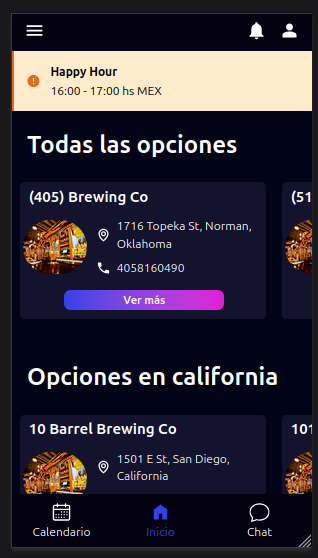

# Prueba Tecnica Brewbery
Prueba técnica full-stack (realizada con Laravel)

## Requisitos Previos

Antes de comenzar, asegúrate de tener instalados los siguientes componentes:

1. **PHP**: Laravel 12 requiere PHP 8.1 o superior.

2. **Composer**: Composer para gestionar las dependencias de PHP.

3. **Servidor Web**: Apache.

4. **Base de Datos**: MySQL .

## Clonar el Repositorio

```bash

git clone https://github.com/jaundeigosl/prueba_tecnica_brewberry.git

cd prueba_tecnica_brewbery

cd cerveceria

```
**Instalar dependencias de PHP**
Ya dentro de la carpeta, realizamos el siguiente comando para instalar las dependecias de PHP

```bash

composer install

```
**Instalar dependencias de Js**
Procedemos con la instalación de las dependecias de javascript.

```bash

npm install

```
**Configuración del entorno**
Ahora se debe de crear un nuevo archivo .env , de manera que se puede copiar el archivo .env.example 
y cambiar los siguientes valores y sustituirlos por los correspondientes.

``` ini
DB_CONNECTION=mysql
DB_HOST=localhost
DB_PORT= 3306 o puerto donde se tenga la conexión a base de datos
DB_DATABASE=nombre_base_datos
DB_USERNAME=usuario_base_de_datos
DB_PASSWORD=contraseña_usuario_base_de_datos

```
**Ejecutar Migraciones**
Ahora procedemos a ejecutar las migraciones.

```bash

php artisan migrate

```
**Levantar el servidor**
Finalmente para levantar el servidor usamos el comando.

```bash

composer run dev

```

Ahora nos ubicamos en el navegador en la dirección localhost:8000 donde se debe de visualizar el proyecto.

## Objetivos

1. **Construir una aplicación web basada en un diseño proporcionado en Figma** 
2. **Consumo de datos desde una API pública de cervecerías**
3. **Construir un sistema básico de autenticación de usuarios**

## Tecnologías usadas

**Frontend:** HTML5, CSS3, Javascript, Blade ,Tailwind.

Para el desarrollo del frontend, además de las tecnologías básicas como HTML, CSS y JavaScript, decidí utilizar Blade y Tailwind. Opté por Blade porque al estar integrado en Laravel, me facilita dividir el diseño en componentes reutilizables y de fácil manejo, lo que agiliza la organización y el mantenimiento del código. Por otra parte elegí Tailwind ya que me permite aplicar estilos de forma directa y sencilla mediante clases utilitarias, lo que simplifica la personalización y el diseño responsivo de la interfaz, adaptando la aplicación a diferentes dispositivos de manera eficiente.

**Backend:** PHP, Laravel, MySQL.

En la parte del backend seleccioné PHP junto con Laravel porque este framework ofrece una integración fluida entre el frontend y el backend, resultando ideal para aplicaciones de pequeño y mediano tamaño. Laravel proporciona todas las herramientas necesarias para la creación y administración de rutas, así como la implementación de autorización y medidas de seguridad básicas. Decidí usar MySQL como sistema de gestión de bases de datos, ya que es la opción recomendada y más compatible con Laravel. Sin embargo para los fines de este proyecto, cualquier gestor de bases de datos habría sido suficiente, dado que solo se requiere almacenar usuarios y sesiones.

Laravel utiliza por defecto la autenticación basada en sesiones y en este proyecto implementé un esquema en la base de datos, que permite llevar un control preciso de las sesiones de los usuarios. Cuando un usuario inicia sesión y sus credenciales son válidas, asocio su ID a la sesión correspondiente y la sesión se regenera para mayor seguridad. Al cerrar sesión elimino el ID del usuario asociado a la sesión para garantizar que no queden registros activos innecesarios.

Configuración de las sesiones
```php
// config/session.php
'driver' => 'database',  // Usando base de datos como almacén
'lifetime' => 120,       // Tiempo en minutos
'expire_on_close' => false,
```

Ejemplo de la validación de credenciales y regeración de sesión.
```php
$credentials = $request->validate([
    'email' => 'required|email|exists:users,email',
    'password' => 'required|string|min:8|max:20'
]);
if(Auth::attempt($credentials)){
    $request->session()->regenerate();
    return redirect()->route('home');

}else{
    return back()->withErrors([
        'email' => 'Credenciales invalidas',
    ])->onlyInput('email');
}
```

Ejemplo de logout

```php
Auth::guard('web')->logout();
$request->session()->invalidate();
$request->session()->regenerateToken();

return redirect()->route('index')
```

## Manual de uso

El directorio raíz muestra una vista con dos botones que permiten escoger entre acceder o registrarse en la aplicación.


Si se toma la opción de registrarse se nos presenta a continuación un formulario con los datos necesarios para registrar un usuario.
Se debe ingresar una dirección de email válida, un nombre y apellido entre 2 y 30 caracteres no numéricos y finalmente una contraseña que conste de 8 a 20 caracteres.


Una vez que el registro sea exitoso, se presentará el formulario de acceso. Aquí se debe ingresar el email y contraseñas utilizados en el registro


Una vez que las credenciales hayan sido autenticadas se nos redirecciona al **Home**, donde se pueden observar todas las opciones disponibles que tiene el usuario al momento de buscar y escoger una cervecería. Si deseáramos salir y cerrar sesión, podemos utilizar el ícono ubicado en la parte superior izquierda con forma de 3 barras horizontales, el cual al hacer click en él nos mostrará la opción de cerrar la sesión y se nos redirigirá a la página de inicio.



Cada cervecería tiene una breve descripción y un botón de **Ver más**, que nos redirige a otra página con más detalles de la cervecería
En esta página podemos  ver imágenes del lugar y opiniones de distintos usuarios, así como también dos botones, uno que nos permite realizar reservas y otro que nos permite personalizar el transporte.


Si se desea retornar podemos utilizar tanto el ícono en la barra inferior denominado **Inicio** como el de la flecha en la barra superior a la izquierda.


